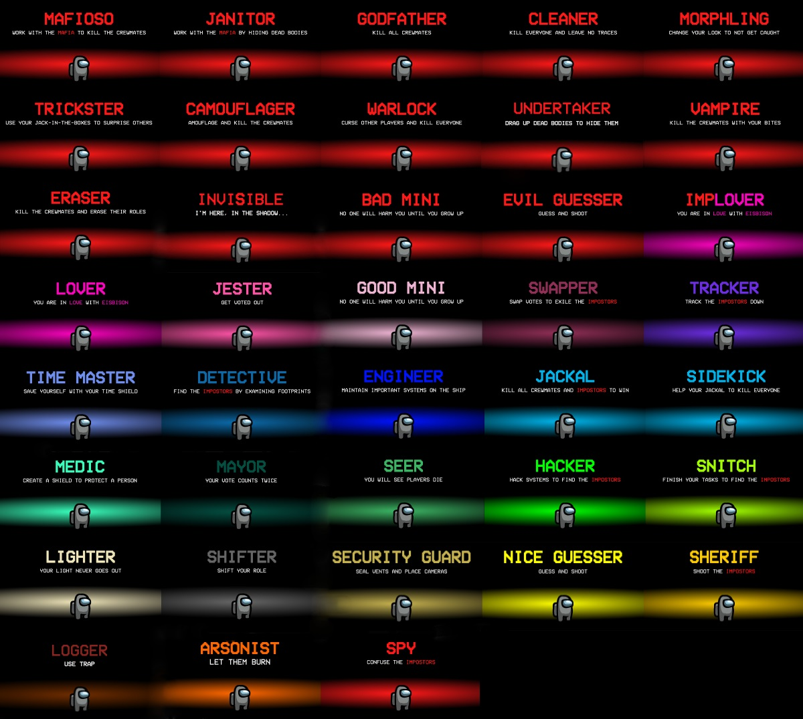
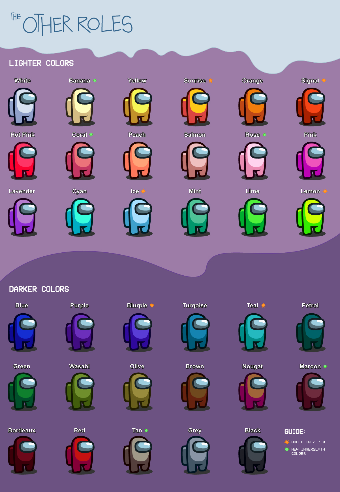
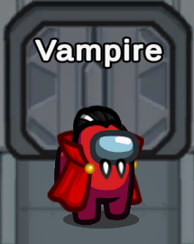

 
<p align="center">
This mod is not affiliated with Among Us or Innersloth LLC, and the content contained therein is not endorsed or otherwise sponsored by Innersloth LLC. Portions of the materials contained herein are property of Innersloth LLC. © Innersloth LLC.</p>

[](https://discord.gg/Hy5u7wGJxK)



# The Forgotten Roles

The **The Forgotten Roles**, is a mod for [Among Us](https://store.steampowered.com/app/945360/Among_Us) forked from [TheOthersRoles](https://github.com/opyruso/theOtherRoles) which adds many new roles, new [Settings](#settings), new [Custom Hats](#custom-hats) and support for [10+ Player Lobbies](#Custom-Servers-and-10+-Players) to the game.
Even more roles are coming soon :)

| Impostors | Crewmates | Neutral | Secondary |
|----------|-------------|-----------------|----------------|
| [Evil Mini](#mini) | [Nice Mini](#mini) | [Arsonist](#arsonist) | [Lover](#lovers) |
| [Evil Guesser](#guesser) | [Nice Guesser](#guesser) | [Jester](#jester) |  |
| [Bounty Hunter](#bounty-hunter) | [Detective](#detective) | [Jackal](#jackal) |  |
| [Camouflager](#camouflager) | [Engineer](#engineer) | [Sidekick](#sidekick) |  |
| [Cleaner](#cleaner) | [Hacker](#hacker) |  |  |
| [Eraser](#eraser) | [Lighter](#lighter) |  |  |
| [Godfather (Mafia)](#mafia) | [Mayor](#mayor) |  |  |
| [Mafioso (Mafia)](#mafia) | [Medic](#medic) |  |  |
| [Janitor (Mafia)](#mafia)  | [Security Guard](#security-guard) |  |  |
| [Morphling](#morphling) | [Seer](#seer) |  |  |
| [Trickster](#trickster) | [Sheriff](#sheriff) |  |  |
| [Vampire](#vampire) | [Shifter](#shifter) |  |  |
| [Warlock](#warlock) | [Snitch](#snitch) |  |  |
| [Invisible](#Invisible)  | [Spy](#spy) |  |  |
| [Undertaker](#Undertaker) | [Swapper](#swapper) |  |  |
| [Ghost Lord](#GhostLord) | [Time Master](#time-master) |  |  |
|  |  [Tracker](#tracker) |  |  |
|  |  [Logger](#logger) |  |  |
|  |  [Bait](#bait) |  |

The [Role Assignment](#role-assignment) sections explains how the roles are being distributed among the players.

# Releases
| Among Us - Version| Mod Version | Link |
|----------|-------------|-----------------|
| **2021.6.30s**| v2.7.3.8| [Download](https://github.com/opyruso/theOtherRoles/releases/tag/2.7.3.8)

# Changelog
<details>
  <summary>Click to show the Changelog</summary>

**Version 2.8.1.3**  
- Remove vent animation of trickster's JackInTheBox 
- Medic can see how long dead players have been dead for at vitals
- If guesser miss guess, dead players will have a message in chat
- Kill cooldown of Evil mini is now proportional to is age
- Engineer can use trickster box
- Bait and Seer can't spawn in same game

**Version 2.7.3.8**
- add color to log Trap
- Fix bug when shifter shift logger
- fib bug when guesser can't guess
</details>

# Installation
## Windows Auto Installation/Updating Using The AmongUsModUpdater
This tool was made by [Narua](https://github.com/Narua2010) and [Jolle](https://github.com/joelweih). It automatically installs/updates the TheOtherRoles mod to the newest version, runs the game and
syncs your game options automatically.

1. Simply get the newest [release](https://github.com/Narua2010/AmongUsModUpdater/releases/latest) of the [AmongUsModUpdater](https://github.com/Narua2010/AmongUsModUpdater)
2. Unzip the folder and run the **setup.exe**

If you have problems with the AmongUsModUpdater, make sure to [contact us](https://discord.gg/csa3pHYdPU).

## Windows Manual Installation
1. Download and unzip the newest [release](https://github.com/Eisbison/TheOtherRoles/releases/latest)
2. Find the folder of your game, for Steam players you can right click in Steam, on the game, a menu will appear proposing you to go to the folders.
3. Make a copy of your game, it's not obligatory but advised, put it where you want.
4. Drag or extract the files from the zip into your game, at the `.exe` level.
5. Run the game (the first launch might take a while)
6. Download TheForgottenRoles.DLL (named TheOthersRoles.DLL)
7. remplace TheOthersRoles.ddl by TheForgottenRoles.dll

Not working? You might want to install the dependency [vc_redist](https://aka.ms/vs/16/release/vc_redist.x86.exe)


**Linux Manual**
1. Install Among Us via Steam
2. Download newest [release](https://github.com/Eisbison/TheOtherRoles/releases/latest) and extract it to ~/.steam/steam/steamapps/common/Among Us
3. Enable `winhttp.dll` via the proton winecfg (https://docs.bepinex.dev/articles/advanced/steam_interop.html#open-winecfg-for-the-target-game)
4. Launch the game via Steam

# Settings
The mod adds a few new settings to Among Us (in addition to the role settings):
- **Streamer Mode:** You can activate the streamer mode in the Among Us settings. It hides the lobby code, the custom server ip and the custom server port. You can set a custom lobby code replacement text, by changing the *Streamer Mode Replacement Text* in the `BepInEx\config\me.eisbison.theotherroles.cfg` file.
- **Number of Impostors:** The number of Impostor count be set inside a lobby
- **Map:** The map can be changed inside a lobby
- **Maximum Number Of Meetings:** You can set the maximum number of meetings that can be called in total (every player still has personal maximum of buttons, but if the maximum number of meetings is reached you can't use your meetings even if you have some left, Impostor and Jackal meetings also count)
- **Allow Skips On Emergency Meetings:** If set to false, there will not be a skip button in emergency meetings. If a player does not vote, he'll vote himself.
- **Hide Player Names:** Hides the names of all players that have role which is unknown to you. Team Lovers/Impostors/Jackal still see the names of their teammates. Impostors can alse see the name of the Spy and everyone can still see the age of the mini.
- **Ghosts Can See Roles**
- **Ghosts Can See Votes**
- **Ghosts Can See The Number Of Remaining Tasks**
- **Dleks:** You are now able to select the Dleks map.
- **Task Counts:** You are now able to select more tasks.
- **Role Summary:** When a game ends there will be a list of all players and their roles and their task progress

# Settings
The mod adds a few new feature to Among Us:
- **Scan** Crewmates can use scanner at the same time (prevent scan abuse)

### Task Count Limits per map
You can configure:
- Up to 4 common tasks
- Up to 23 short tasks
- Up to 15 long tasks

Please note, that if the configured option exceeds the available number of tasks of a map, the tasks will be limited to that number of tasks. \
Example: If you configure 4 common tasks on Airship crewmates will only receive 2 common tasks, as airship doesn't offer more than 2 common tasks.

| Map | Common Tasks | Short Tasks | Long Tasks |
|----------|:-------------:|:-------------:|:-------------:|
| Skeld / Dleks | 2 | 19 | 8
| Mira HQ | 2 | 13 | 11
| Polus | 4 | 14 | 15
| Airship | 2 | 23 | 15
-----------------------

# Colors


# Roles

## Role Assignment
We are still improving the role assignment system. It's not that intuitive right now, but it's more flexible than the older one
if you're using it right.

First you need to choose how many special roles of each kind (Impostor/Neutral/Crewmate) you want in the game.
The count you set will only be reached, if there are enough Crewmates/Impostors in the game and if enough roles are set to be in the game (i.e. they are set to > 0%). The roles are then being distributed as follows:
- First all roles that are set to 100% are being assigned to arbitrary players
- After that each role that has 10%-90% selected adds 1-9 tickets to a ticket pool (there exists a ticket pool for Crewmates, Neutrals and Impostors). Then the roles will be selected randomly from the pools as long it's possible (until the selected number is reached, until there are no more Crewmates/Impostors or until there are no more tickets). If a role is selected from the pool, obviously all the tickets of that role are being removed.
- The Mafia, Lovers and Mini are being selected independently (without using the ticket system) according to the spawn chance you selected. After that the Crewmate, Neutral and Impostor roles are selected and assigned in a random order.

**Example:**\
Settings: 2 special Crewmate roles, Snitch: 100%, Hacker: 10%, Tracker: 30%\
Result: Snitch is assigned, then one role out of the pool [Hacker, Tracker, Tracker, Tracker] is being selected\
Note: Changing the settings to Hacker: 20%, Tracker: 60% would statistically result in the same outcome .


## Mafia
### **Team: Impostors**
The Mafia are a group of three Impostors.\
The Godfather works like a normal Impostor.\
The Mafioso is an Impostor who cannot kill nor sabotage until the Godfather is dead.\
The Janitor is an Impostor who cannot kill nor sabotage, but they can hide dead bodies instead.\
\
**NOTE:**
- There have to be 3 Impostors activated for the mafia to spawn.

### Game Options
| Name | Description |
|----------|:-------------:|
| Mafia Spawn Chance | -
| Janitor Cooldown | -
-----------------------

## Morphling
### **Team: Impostors**
The Morphling is an Impostor which can additionally scan the appearance of a player. After an arbitrary time they can take on that appearance for 10s.
\
**NOTE:**
- They shrink to the size of the Mini when they copies its look.
- The Hacker sees the new color on the admin table.
- The color of the footprints changes accordingly (also the ones that were already on the ground).
- The other Impostor still sees that they are an Impostor (the name remains red).
- The shield indicator changes accordingly (the Morphling gains or loses the shield indicator)
- Tracker and Snitch arrows keep working.

### Game Options
| Name | Description |
|----------|:-------------:|
| Morphling Spawn Chance | -
| Morphling Cooldown | -
| Morph Duration | Time the Morphling stays morphed
-----------------------

## Camouflager
### **Team: Impostors**
The Camouflager is an Impostor which can additionally activate a camouflage mode.
The camouflage mode lasts for 10s and while it is active, all player names/pets/hats
are hidden and all players have the same color.\
\
**NOTE:**
- The Mini will look like all the other players
- The color of the footprints turns gray (also the ones that were already on the ground).
- The Hacker sees gray icons on the admin table
- The shield is not visible anymore
- Tracker and Snitch arrows keep working

### Game Options
| Name | Description |
|----------|:-------------:|
| Camouflager Spawn Chance | -
| Camouflager Cooldown | -
| Camo Duration | Time players stay camouflaged
-----------------------

## Vampire  

### **Team: Impostors**
The Vampire is an Impostor, that can bite other player. Bitten players die after a configurable amount of time.\
If the Vampire spawn chance is greater 0 (even if there is no Vampire in the game), all players can place one garlic.\
If a victim is near a garlic, the "Bite Button" turns into the default "Kill Button" and the Vampire can only perform a normal kill.\
\
**NOTE:**
- If a bitten player is still alive when a meeting is being called, he dies at the start of the meeting.
- The cooldown is the same as the default kill cooldown (+ the kill delay if the Vampire bites the target).
- If there is a Vampire in the game, there can't be a Warlock

### Game Options
| Name | Description |
|----------|:-------------:|
| Vampire Spawn Chance | -
| Vampire Kill Delay | -
| Vampire Cooldown | Sets the kill/bite cooldown
| Vampire Can Kill Near Garlics | The Vampire can never bite when his victim is near a garlic. If this option is set to true, he can still perform a normal kill there.
-----------------------

## Eraser
### **Team: Impostors**
The Eraser is an Impostor that can erase the role of every player.\
The targeted players will lose their role after the meeting right before a player is exiled.\
After every erase, the cooldown increases by 10 seconds.\
The erase will be performed, even if the Eraser or his target die before the next meeting.\
By default the Eraser can erase everyone but the Spy and other Impostors. Depending on the options
he can also erase them (Impostors will lose their special Impostor ability).
\
**NOTE:**
- The Shifter shift will always be triggered before the Erase (hence either the new role of the Shifter will be erased or the Shifter saves the role of his target, depending on who the Eraser erased)
- Erasing a Lover automatically erases the other Lover as well (if the second Lover is an ImpLover, he will turn into an Impostor)
- Erasing a Jackal that has a Sidekick, triggers the Sidekick promotion if it's activated in the settings
- As the erasing is being triggered before the eject of a player, erasing and voting out a Lover in the same round, would result in the
ex Lover surviving as the partnership was erased before. Also a Jester win would not happen, as the erase will be triggered before.

### Game Options
| Name | Description |
|----------|:-------------:|
| Eraser Spawn Chance | -
| Eraser Cooldown | The Erasers cooldown will increase by 10 seconds after every erase.
| Eraser Can Erase Anyone | If set to false, he can't erase the Spy and other Impostors
-----------------------

## Trickster
### **Team: Impostors**
The Trickster is an Impostor that can place 3 jack-in-the-boxes that are invisible at first to other players. \
If the Trickster has placed all of his boxes they will be converted into a vent network usable only by the Trickster himself and the Engineer, but the boxes are revealed to the others. \
If the boxes are converted to a vent network, the Trickster gains a new ability "Lights out" to limit the visibility of Non-Impostors, that cannot be fixed by other players. Lights are automatically restored after a while. \
boxes dosn't have animation.
\
**NOTE:**
- Impostors will get a text indicator at the bottom of the screen to notify them if the lights are out due to the Trickster ability, as there is no sabotage arrows or task to sabotage text to otherwise notify them about it.

### Game Options
| Name | Description |
|----------|:-------------:|
| Trickster Spawn Chance | -
| Trickster Box Cooldown | Cooldown for placing jack-in-the-boxes
| Trickster Lights Out Cooldown | Cooldown for his "lights out" ability
| Trickster Lights Out Duration | Duration after which the light is automatically restored
-----------------------

## Cleaner
### **Team: Impostors**
The Cleaner is an Impostor who has the ability to clean up dead bodies. \

\
**NOTE:**
- The Kill and Clean cooldown are shared, preventing him from immediately cleaning his own kills.

### Game Options
| Name | Description |
|----------|:-------------:|
| Cleaner Spawn Chance | -
| Cleaner Cooldown | Cooldown for cleaning dead bodies
-----------------------


## Warlock
### **Team: Impostors**
The Warlock is an Impostor, that can curse another player (the cursed player doesn't get notified).\
If the cursed person stands next to another player, the Warlock is able to kill that player (no matter how far away he is).\
Performing a kill with the help of a cursed player, will lift the curse and it will result in the Warlock being unable to move for a configurable amount of time.\
The Warlock can still perform normal kills, but the two buttons share the same cooldown.

\
**NOTE:**
- The Warlock can always kill his Impostor mates (and even himselfs) using the "cursed kill"
- If there is a Warlock in the game, there can't be a Vampire
- Performing a normal kill, doesn't lift the curse

### Game Options
| Name | Description |
|----------|:-------------:|
| Warlock Spawn Chance | -
| Warlock Cooldown | Cooldown for using the Curse and curse Kill
| Warlock Root Time | Time the Warlock is rooted in place after killing using the curse
-----------------------


## Bounty Hunter
### **Team: Impostors**
\
Created by  [Mallöris](https://github.com/Mallaris)\
\
The Bounty Hunter is an Impostor, that continuously get bountys (the targeted player doesn't get notified).\
The target of the Bounty Hunter swaps after every meeting and after a configuarble amount of time.\
If the Bounty Hunter kills his target, his kill cooldown will be a lot less than usual.\
Killing a player that's not his current target results in an increased kill cooldown.\
Depending on the options, there'll be an arrow pointing towards the current target.

\
**NOTE:**
- The target won't be an Impostor or a Spy
- Killing the target resets the timer and a new target will be selected.

### Game Options
| Name | Description |
|----------|:-------------:|
| Bounty Hunter Spawn Chance | -
| Duration After Which Bounty Changes | -
| Cooldown After Killing Bounty | -
| Additional Cooldown After Killing Others | Time will be added to the normal impostor cooldown if the Bounty Hunter kills a not-bounty player
| Show Arrow Pointing Towards The Bounty | If set to true an arrow will appear (only visiable for the Bounty Hunter)
| Bounty Hunter Arrow Update Intervall | Sets how often the position is being updated
-----------------------

## Ghost Lord
### **Team: Impostors**

The Ghost Lord is an Impostor, that can walk through everyting (including wall, lava ...)

\
**NOTE:**
- If your power finishes inside wall or something else that you can't go normally, you will be stuck inside until you use your power again to escape.

### Game Options
| Name | Description |
|----------|:-------------:|
| Ghost Lord Spawn Chance | -
| Ghost Lord Cooldown | -
| Ghost Lord Duration | Time player stay in ghost.
-----------------------

## Invisible
### **Team: Impostors**

The Invisible is an Impostor, that can turn invisible to everyone.

\
**NOTE:**
- He is able to kill and vent during his skill.

### Game Options
| Name | Description |
|----------|:-------------:|
| Invisible Spawn Chance | -
| Invisible Cooldown | -
| Invisible Duration | Time player stay invisible.
-----------------------

## Guesser
### **Team: Crewmates or Impostors**
The Guesser can be a Crewmate or an Impostor (depending on the settings).\
The Guesser can shoot a player during the meeting, by guessing its role. If the guess is wrong, the Guesser dies instead.\
You can select how many players can be shot per meeting and how many players can be shot per game.\
The guesses Impostor and Crewmate are only right, if the player is part of the corresponding team and has no special role.\
You can only shoot during the voting time.

\
**NOTE:**
- The vote of a shot player, won't be counted
- You can't guess the role **Nice Mini** for obvious reasons
- You can't guess the role **Lover**, you'll have to guess the primary role of one of the Lovers, to kill both of them
- Jester wins won't be triggered, if the Guesser shoots the Jester before the Jester gets voted out

### Game Options
| Name | Description |
|----------|:-------------:|
| Guesser Spawn Chance | -
| Chance That The Guesser Is An Impostor | -
| Guesser Number Of Shots Per Game| -
| Guesser Number Of Shots Per Meeting| -
-----------------------

## Lovers
### **Team: Lovers (and secondary team)**
There are always two Lovers which are linked together.\
Their primary goal is it to stay alive together until the end of the game.\
If one Lover dies (and the option is activated), the other Lover suicides.\
You can select if Lovers are able to have a second role (could be a Neutral, Crewmate or Impostor Role)\
You can specify the chance of one Lover being an Impostor.\
The Lovers never know the role of their partner, they only see who their partner is.\
The Lovers win, if they are both alive when the game ends. They can also win with their original team (e.g. a dead Impostor Lover can win with the Impostors, an Arsonist Lover can still achieve an Arsonist win)\
If one of the Lovers is a killer (i.e. Jackal/Sidekick/Impostor), they can achieve a "Lovers solo win" where only the Lovers win.\
If there is no killer among the Lovers (e.g. an Arsonist Lover + Crewmate Lover) and they are both alive when the game ends, they win together with the Crewmates.\
If there's an team Impostor/Jackal Lover in the game, the tasks of a Crewmate Lover won't be counted (for a task win) as long as he's alive. If the Lover dies, his tasks will also be counted.\
\
**NOTE:**
- In a 2 Cremates vs 2 Impostors (or 2 members of team Jackal) and the Lovers are not in the same team, the game is not automatically over since the Lovers can still achieve a solo win. E.g. if there are the following roles Impostor + ImpLover + Lover + Crewmate left, the game will not end and the next kill will decide if the Impostors or Lovers win.
- The Lovers can change if the Shifter takes the role of a Lovers

### Game Options
| Name | Description |
|----------|:-------------:|
| Lovers Spawn Chance | -
| Chance That One Lover Is Impostor | -
| Both Lovers Die | Whether the second Lover suicides, if the first one dies
| Lovers Can Have Another Role | If set to true, the Lovers can have a second role
-----------------------


## Sheriff
### **Team: Crewmates**
The Sheriff has the ability to kill Impostors.
If they try to kill a Crewmate, they die instead.

**NOTE:**
- If the Sheriff shoots the person the Medic shielded, the Sheriff and the shielded person **both remain unharmed**.
- If the Sheriff shoots a Mini Impostor, the Sheriff dies if the Mini is still growing up. If it's 18, the Mini Impostor dies.

### Game Options
| Name | Description |
|----------|:-------------:|
| Sheriff Spawn Chance | -
| Sheriff Cooldown | -
| Neutrals Can Die To Sheriff | -
-----------------------

## Jester
### **Team: Neutral**
The Jester does not have any tasks. They win the game as a solo, if they get voted out during a meeting.

### Game Options
| Name | Description |
|----------|:-------------:|
| Jester Spawn Chance | -
| Jester can call emergency meeting | Option to disable the emergency button for the Jester
| Jester can sabotage | Option to allow the Jester to sabotage
-----------------------

## Arsonist
### **Team: Neutral**
The Arsonist does not have any tasks, he has to win the game as a solo.\
The Arsonist can douse other players by pressing the douse button and remaining next to the player for a few seconds.\
If the player that the Arsonist douses walks out of range, the cooldown will reset to 0.\
After dousing everyone alive the Arsonist can ignite all the players which results in an Arsonist win.

### Game Options
| Name | Description |
|----------|:-------------:|
| Arsonist Spawn Chance | -
| Arsonist Countdown | -
| Arsonist Douse Duration | The time it takes to douse a player
-----------------------

## Seer
### **Team: Crewmates**
The Seer has two abilities (one can activate one of them or both in the options).
The Seer sees the souls of players that died a round earlier, the souls slowy fade away.
The Seer gets a blue flash on his screen, if a player dies somewhere on the map.

### Game Options
| Name | Description |
|----------|:-------------:|
| Seer Spawn Chance | -
| Seer Mode | Options: Show death flash and souls, show death flash, show souls
| Seer Limit Soul Duration | Toggle if souls should turn invisible after a while
| Seer Soul Duration | Sets how long it will take the souls to turn invisible after a meeting
-----------------------

## Engineer
### **Team: Crewmates**
The Engineer (if alive) can fix one sabotage per game from anywhere on the map.\
The Engineer can use vents. If the Engineer is inside a vent, the Impostors will see a blue outline
around all vents on the map (in order to warn them).
Because of the vents the Engineer might not be able to start some tasks using the "Use" button,
you can double click on the tasks instead.
\
**NOTE:**
- The kill button of Impostors activates if they stand next to a vent where the Engineer is. They can also kill them there. No other action (e.g. Morphling sample, Shifter shift, ...) can affect players inside vents.

### Game Options
| Name | Description |
|----------|:-------------:|
| Engineer Spawn Chance | -
-----------------------

## Detective
### **Team: Crewmates**
The Detective can see footprints that other players leave behind.
The Detective's other feature shows when they report a corpse: they recieve clues about the killer's identity. The type of information they get is based on the time it took them to find the corpse.
\
**NOTE:**
- When people change their colors (because of a morph or camouflage), all the footprints also change their colors (also the ones that were already on the ground). If the effects are over, all footprints switch back to the original color.
- The Detective does not see footprints of players that sit in vents
- More information about the [colors](#colors)

### Game Options
| Name | Description |
|----------|:-------------:|
| Detective Spawn Chance | -
| Anonymous Footprints | If set to true, all footprints will have the same color. Otherwise they will have the color of the respective player.
| Footprint Intervall | The intervall between two footprints
| Footprint Duration | Sets how long the footprints remain visible.
| Time Where Detective Reports Will Have Name | The amount of time that the Detective will have to report the body since death to get the killer's name.  |
| Time Where Detective Reports Will Have Color Type| The amount of time that the Detective will have to report the body since death to get the killer's color type. |
-----------------------

## Lighter
### **Team: Crewmates**
The Lighter can turn on his Lighter every now and then, which increases his vision by a costumizable amount.

### Game Options
| Name | Description |
|----------|:-------------:|
| Lighter Spawn Chance | -
| Lighter Mode Vision On Lights On | The vision the Lighter has when the lights are on and the Lighter mode is on
| Lighter Mode Vision On Lights Off | The vision the Lighter has when the lights are down and the Lighter mode is on
| Lighter Cooldown | -
| Lighter Duration | -
-----------------------

## Mini
### **Team: Crewmates or Impostors**
The Mini can be a Crewmate (67% chance) or an Impostor (33% chance).\
The Mini's character is smaller and hence visible to everyone in the game.\
The Mini cannot be killed until it turns 18 years old, however it can be voted out.\
**Impostor Mini:**
  - While growing up the kill cooldown is doubled. When it's fully grown up its kill cooldown is 2/3 of the default one.
  - If it gets thrown out of the ship, everything is fine.

**Crewmate Mini:**
  - The Crewmate Mini aims to play out the strength its invincibility in the early game.
  - If it gets thrown out of the ship before it turns 18, everyone loses. So think twice before you vote out a Mini.

**NOTE:**
- Impostors can't kill the Mini (the button does not work) until it turns 18
- The Sheriff can kill the Impostor Mini, but only if it's fully grown up

### Game Options
| Name | Description |
|----------|:-------------:|
| Mini Spawn Chance | -
| Mini  | Mini Growing Up Duration
-----------------------

## Medic
### **Team: Crewmates**
The Medic can shield (highlighted by an outline around the player) one player per game, which makes the player unkillable.\
**Vitals**: The Medic can see how long dead players have been dead for.\
The shielded player can still be voted out and might also be an Impostor.\
If set in the options, the shielded player will get a red flash on their screen if someone (Impostor, Sheriff, ...) tried to murder them.
If the Medic dies, the shield disappears with them.\
The Sheriff will not die if they try to kill a shielded Crewmate and won't perform a kill if they try to kill a shielded Impostor.\
The Medic's other feature shows when they report a corpse: they will see how long ago the player died
\
**NOTE:**
- If the shielded player is a Lover and the other Lover dies, they nevertheless kill themselves.
- If the Shifter has a shield or their target has a Shield, the shielded player switches.


### Game Options
| Name | Description | Options |
|----------|:-------------:|:-------------:|
| Medic Spawn Chance | - | -
| Show Shielded Player | Sets who sees if a player has a shield | "Everyone", "Shielded + Medic", "Medic"
| Shielded Player Sees Murder Attempt| Whether a shielded player sees if someone tries to kill him | True/false |
-----------------------

## Mayor
### **Team: Crewmates**
The Mayor leades the Crewmates by having a vote that counts twice.\
The Mayor can always use his meeting, even if the maximum number of meetings was reached.

### Game Options
| Name | Description |
|----------|:-------------:|
| Mayor Spawn Chance | -
-----------------------

## Hacker
### **Team: Crewmates**
If the Hacker activates the "Hacker mode", the Hacker gets more information than others from the admin table and vitals for a set duration.\
Otherwise he sees the same information as everyone else.
**Admin table:** The Hacker can see the colors (or color types) of the players on the table.\
**Vitals**: The Hacker can see how long dead players have been dead for.\
\
**NOTE:**
- If the Morphling morphes or the Camouflager camouflages, the colors on the admin table change accordingly
- More information about the [colors](#colors)

### Game Options
| Name | Description |
|----------|:-------------:|
| Hacker Spawn Chance | -
| Hacker Cooldown| -
| Hacker Duration | Sets how long the "Hacker mode" remains active
| Hacker Only Sees Color Type | Sets if the Hacker sees the player colors on the admin table or only white/gray (for Lighter and darker colors)
-----------------------


## Shifter
### **Team: Crewmates**
The Shifter can take over the role of another Crewmate, the other player will transform into a Crewmate.\
The Shift will always be performed at the end of the next meeting right before a player is exiled. The target needs to be chosen during the round.\
Even if the Shifter or the target dies before the meeting, the Shift will still be performed.\
Swapping roles with an Impostor or Neutral fails and the Shifter commits suicide after the next meeting (there won't be any body).\
The Shifter aims to save roles from leaving the game, by e.g. taking over a Sheriff or Medic that is known to the Impostors.\
This works especially well against the Eraser, but also gives the Eraser the possiblity to act like a Shifter.\
The **special interactions** with the Shifter are noted in the chapters of the respective roles.\
\
**NOTE:**
- The Shifter shift will always be triggered before the Erase (hence either the new role of the Shifter will be erased or the Shifter saves the role of his target, depending on who the Eraser erased)
- If the Shifter takes over a role, their new cooldowns will start at the maximum cooldown of the ability
- One time use abilities (e.g. shielding a player or Engineer sabotage fix) can only used by one player in the game (i.e. the Shifter
can only use them, if the previous player did not used them before)

### Game Options
| Name | Description
|----------|:-------------:|
| Shifter Spawn Chance | -
| Shifter Shifts Modifiers | Sets if Lovers and/or Medic Shield will be shifted
-----------------------

## Time Master
### **Team: Crewmates**
The Time Master has a time shield which he can activate. The time shield remains active for a configurable amount of time.\
If a player trys to kill the Time Master while the time shield is active, the kill won't happen and the
time will rewind for a set amount of time.\
The kill cooldown of the killer won't be reset, so the Time Master
has to make sure that the game won't result in the same situation.\
The Time Master won't be affected by the rewind.\
\
**NOTE:**
- Only the movement is affected by the rewind
- A Vampire bite will trigger the rewind. If the Time Master misses shielding the bite, he can still shield the kill which happens a few seconds later.
- If the Time Master was bitten and has his shield active before when a meeting is called, he survives but the time won't be rewinded.
- If the Time Master has a Medic shield, he won't rewind.
- The shield itself ends immediately when triggered. So the timemaster can be attacked again as soon as the rewind ends.

### Game Options
| Name | Description |
|----------|:-------------:|
| Time Master Spawn Chance | - |
| Time Master Cooldown | - |
| Rewind Duration | How much time to rewind |
| Time Master Shield Duration |
-----------------------

## Swapper
### **Team: Crewmates**
During meetings the Swapper can exchange votes that two people get (i.e. all votes
that player A got will be given to player B and vice versa).\
Because of the Swappers strength in meetings, they might not start emergency meetings
and can't fix lights and comms.

### Game Options
| Name | Description
|----------|:-------------:|
| Swapper Spawn Chance | -
| Swapper can call emergency meeting | Option to disable the emergency button for the Swapper
| Swapper can only swap others | Sets whether the Swapper can swap himself or not
-----------------------

## Tracker
### **Team: Crewmates**
The Tracker can select one player in a game and tracks this player for the rest of the game.
An arrow points to the last tracked position of the player.
The arrow updates it's position every few seconds (configurable).

### Game Options
| Name | Description
|----------|:-------------:|
| Tracker Spawn Chance | -
| Tracker Update Intervall | Sets how often the position is being updated
-----------------------

## Snitch
### **Team: Crewmates**
When the Snitch finishes all the tasks, arrows will appear (only visible to the Snitch) that point to the Impostors.
When the Snitch has one task left (configurable) the Snitch will be revealed to the Impostors, also with an arrow.

### Game Options
| Name | Description
|----------|:-------------:|
| Snitch Spawn Chance | -
| Task Count Where Impostors See Snitch | -
-----------------------

## Logger
### **Team: Crewmates**
Logger can place 3 rigged garlic that will log player walking on it (like sensor on mira HQ). player name for each garlic are written in chat (only for logger) at the beginning of next meeting.

**NOTE:**
- invicible are not register during his skill.
- during communication sabotage, people are register as "anonymous".
- during morphing skill, morphing target will be register instead of morphing himself.

### Game Options
| Name | Description
|----------|:-------------:|
| Logger Spawn Chance | -
-----------------------

## Bait
### **Team: Crewmates**

Created by  [Mallöris](https://github.com/Mallaris)\

The Bait is a Crewmate that if killed, forces the killer to self report the body (you can configure a delay in the options).
Additionally, the Bait can see if someone is inside a vent (depending on the options the exact vent gets
an outline or all vents do).

**NOTE:**
- If there is a Seer in the game, there can't be a Bait


### Game Options
| Name | Description
|----------|:-------------:|
| Bait Spawn Chance | -
| Bait Highlight All Vents | If set to true, all vents will be highlighted if a player is inside of one of them. If set to false, only the vents where players are siting in will be highlighted.
| Bait Report Delay | -

## Jackal
### **Team: Jackal**
The Jackal is part of an extra team, that tries to eliminate all the other players.\
The Jackal has no tasks and can kill Impostors, Crewmates and Neutrals.\
The Jackal (if allowed by the options) can select another player to be his Sidekick.
Creating a Sidekick removes all tasks of the Sidekick and adds him to the team Jackal. The Sidekick loses his current role (except if he's a Lover, then he plays in two teams).
The "Create Sidekick Action" may only be used once per Jackal or once per game (depending on the options).
The Jackal can also promote Impostors to be his Sidekick, but depending on the options the Impostor will either really turn into the Sidekick and leave the team Impostors or he will just look like the Sidekick to the Jackal an remain as he was.\
\
The team Jackal enables multiple new outcomes of the game, listing some examples here:
- The Impostors could be eliminated and then the crew plays against the team Jackal.
- The Crew could be eliminated, then the Team Jackal fight against the Impostors (the Crew can still make a task win in this scenario)

The priority of the win conditions is the following:
1. Crewmate Mini lose by vote
2. Jester wins by vote
3. Arsonist win
4. Team Impostor wins by sabotage
5. Team Crew wins by tasks (also possible if the whole Crew is dead)
6. Lovers among the last three players win
7. Team Jackal wins by outnumbering (When the team Jackal contains an equal or greater amount of players than the Crew and there are 0 Impostors left and team Jackal contains no Lover)
8. Team Impostor wins by outnumbering (When the team Impostors contains an equal or greater amount of players than the Crew and there are 0 players of the team Jackal left and team Impostors contains no Lover)
9. Team Crew wins by outnumbering (When there is no player of the team Jackal and the team Impostrs left)

**NOTE:**
- The Jackal (and his Sidekick) may be killed by a Sheriff.
- A Jackal cannot target the Mini, while it's growing up. After that he can kill it or select it as its Sidekick
- The Crew can still win, even if all of their members are dead, if they finish their tasks fast enough (that's why converting the last Crewmate with tasks left into a Sidekick results in a task win for the crew)

If both Impostors and Jackals are in the game the game continues even if all Crewmates are dead. Crewmates may still win in this case by completing their tasks. Jackal and Impostor have to kill each other.


### Game Options
| Name | Description
|----------|:-------------:|
| Jackal Spawn Chance | - |
| Jackal/Sidekick Kill Cooldown | Kill cooldown |
| Jackal Create Sidekick Cooldown | Cooldown before a Sidekick can be created |
| Jackal can use vents | Yes/No |
| Jackal can create a Sidekick | Yes/No |
| Jackals promoted from Sidekick can create a Sidekick | Yes/No (to prevent the Jackal team from growing) |
| Jackals can make an Impostor to his Sidekick | Yes/No (to prevent a Jackal from turning an Impostor into a Sidekick, if he uses the ability on an Impostor he sees the Impostor as Sidekick, but the Impostor isn't converted to Sidekick. If this option is set to "No" Jackal and Sidekick can kill each other ) |
| Jackal and Sidekick have Impostor vision | - |
-----------------------

## Sidekick
### **Team: Jackal**
Gets assigned to a player during the game by the "Create Sidekick Action" of the Jackal and joins the Jackal in his quest to eliminate all other players.\
Upon the death of the Jackal (depending on the options), he might get promoted to Jackal himself and potentially even assign a Sidekick of his own.
\
**NOTE:**
- A player that converts into a Sidekick loses his previous role and tasks (if he had one), except the Lover role.
- The Sidekick may be killed by a Sheriff.
- The Sidekick cannot target the Mini, while it's growing up.

### Game Options
| Name | Description
|----------|:-------------:|
| Jackal/Sidekick Kill Cooldown | Uses the same kill cooldown setting as the Jackal |
| Sidekick gets promoted to Jackal on Jackal death |  Yes/No |
| Sidekick can kill | Yes/No |
| Sidekick can use vents | Yes/No |
-----------------------

## Spy
### **Team: Crewmates**
The Spy is a Crewmate, which has no special abilities.\
The Spy looks like an additional Impostor to the Impostors, they can't tell the difference.\
There are two possibilities (depending on the set options):
- The Impostors can't kill the Spy (because otherwise their kill button would reveal, who the Spy is)
- The Impostors can kill the Spy but they can also kill their Impostor partner (if they mistake another Impostor for the Spy)
You can set whether the Sheriff can kill the Spy or not (in order to keep the lie alive).

### Game Options
| Name | Description
|----------|:-------------:|
| Spy Spawn Chance |
| Spy Can Die To Sheriff |
| Impostors Can Kill Anyone If There Is A Spy | This allows the Impostors to kill both the Spy and their Impostor partners
| Spy Can Enter Vents | Allow the Spy to enter/exit vents (but not actually move to connected vents)
| Spy Has Impostor Vision | Give the Spy the same vision as the Impostors have
-----------------------

## Security Guard
### **Team: Crewmates**
The Security Guard is a Crewmate that has a certain amount of screws that he can use for either sealing vents or for placing new cameras.\
Placing a new camera and sealing vents takes a configurable amount of screws. The total number of screws that a Security Guard has can also be configured.\
The new camera will be visible after the next meeting and accessible by everyone.\
The vents will be sealed after the next meeting, players can't enter or exit sealed vents, but they can still "move to them" underground.\
**NOTE:**
- Tickster boxes can't be sealed
- The Security Guard can't place Cameras on MiraHQ
- The remaining number of screws can be seen above his special button
- On Skeld the four cameras will be replaced every 3 seconds (with the next four cameras). You can also navigate manually using the arrow keys.


### Game Options
| Name | Description
|----------|:-------------:|
| Security Guard Spawn Chance |
| Security Guard Cooldown |
| Security Guard Number Of Screws | The number of screws that a Security Guard can use in a game
| Number Of Screws Per Cam | The number of screws it takes to place a camera
| Number Of Screws Per Vent | The number of screws it takes to seal a vent
-----------------------

# Custom Servers and 10+ Players
We always recommend you to play on custom servers rather than on the official ones. If you want to play with more than 10 players in one lobby, you're required to use a custom server. Credits for the original implementation that allowed 10+ player lobbies go to the creaters of the [CrowdedMod](https://github.com/CrowdedMods/CrowdedMod).

**Setup the Clients:**
1. Open the region menu where you can choose between the different regions
2. Select the region *Custom*
3. Enter the ip/domain and the port of your custom server in the corresponding text fields

**Setup the Server:**
1. Get the [Impostor](https://github.com/Impostor/Impostor) release for the Among Us version **2021.3.31 - 2021.4.2**
2. Follow the steps (using the server release you just downloaded) on the official [Impostor-Documentation](https://github.com/Impostor/Impostor/wiki/Running-the-server)
3. Make sure to set the following values to false in the `config.json` file:
```
    ...
    "AntiCheat": {
      "Enabled": false,
      "BanIpFromGame": false
    }
```
4. Make sure to forward the right ports on the hosting machine
5. Run the server and setup the client

**Setting up Server as Docker Container:** \
If you want to run the server as a docker container you'll need to use the image
```
aeonlucid/impostor:nightly
```
(Currently only the "nightly" tag is starting a server supporting 2021.3.31 or later)

In addition to running it, the environment variables to disable the AntiCheat feature need to be set.
```
IMPOSTOR_AntiCheat__Enabled=false
IMPOSTOR_AntiCheat__BanIpFromGame=false
```

Example to docker run command:
```
docker run -p 22023:22023/udp --env IMPOSTOR_AntiCheat__Enabled=false --env IMPOSTOR_AntiCheat__BanIpFromGame=false aeonlucid/impostor:nightly
```

Or use to run it in the background
```
docker run -d -p 22023:22023/udp --env IMPOSTOR_AntiCheat__Enabled=false --env IMPOSTOR_AntiCheat__BanIpFromGame=false aeonlucid/impostor:nightly
```

# Credits & Resources
[TheOthersRoles](https://github.com/Eisbison/TheOtherRoles) original project. 
[OxygenFilter](https://github.com/NuclearPowered/Reactor.OxygenFilter) - For all the version v2.3.0 to v2.6.1, we were using the OxygenFilter for automatic deobfuscation\
[Reactor](https://github.com/NuclearPowered/Reactor) - The framework used for all version before v2.0.0\
[BepInEx](https://github.com/BepInEx) - Used to hook game functions\
[Essentials](https://github.com/DorCoMaNdO/Reactor-Essentials) - Custom game options by **DorCoMaNdO**:
- Before v1.6: We used the default Essentials release
- v1.6-v1.8: We slightly changed the default Essentials. The changes can be found on this [branch](https://github.com/Eisbison/Reactor-Essentials/tree/feature/TheOtherRoles-Adaption) of our fork.
- v2.0.0 and later: As we're not using Reactor anymore, we are using our own implementation, inspired by the one from **DorCoMaNdO**

[Jackal and Sidekick](https://www.twitch.tv/dhalucard) - Original idea for the Jackal and Sidekick comes from **Dhalucard**\
[Among-Us-Love-Couple-Mod](https://github.com/Woodi-dev/Among-Us-Love-Couple-Mod) - Idea for the Lovers role comes from **Woodi-dev**\
[Jester](https://github.com/Maartii/Jester) - Idea for the Jester role comes from **Maartii**\
[ExtraRolesAmongUs](https://github.com/NotHunter101/ExtraRolesAmongUs) - Idea for the Engineer and Medic role comes from **NotHunter101**. Also some code snippets come of the implementation were used.\
[Among-Us-Sheriff-Mod](https://github.com/Woodi-dev/Among-Us-Sheriff-Mod) - Idea for the Sheriff role comes from **Woodi-dev**\
[TooManyRolesMods](https://github.com/Hardel-DW/TooManyRolesMods) - Idea for the Detective and Time Master roles comes from **Hardel-DW**. Also some code snippets of the implementation were used.\
[TownOfUs](https://github.com/slushiegoose/Town-Of-Us) - Idea for the Swapper, Shifter, Arsonist and a similar Mayor role come from **Slushiegoose**\
[Ottomated](https://twitter.com/ottomated_) - Idea for the Morphling, Snitch and Camouflager role come from **Ottomated**\
[Crowded-Mod](https://github.com/CrowdedMods/CrowdedMod) - Our implementation for 10+ player lobbies is inspired by the one from the **Crowded Mod Team**\

# Custom Hats
## Create and submit new hat designs
We're awaiting your creative hat designs and we'll integrate all the good ones in our mod.
Here are a few instructions, on how to create a custom hat:

- **Creation:** A hat consists of up to three textures. The aspect ratio of the textures has to be `4:5`, we recommend `300px:375px`:
  - `Main texture (required)`:
    - This is the main texture of your hat. It will usually be rendered in front of the player, if you set the `behind` parameter it will be rendered behind the player.
    - The name of the texture needs to follow the pattern *hatname.png*, but you can also set some additional parameters in the file name by adding `_parametername` to the file name (before the *.png*).
    - Parameter `bounce`: This parameter determines whether the hat will bounce while you're walking or not.
    - Parameter `adaptive`: If this parameter is set, the Among Us coloring shader will be applied (the shader that replaces some colors with the colors that your character is wearing in the game). The color red (#ff0000) will be replaced with the primary color of your player and the color blue (#0000ff) with the secondary color. Also other colors will be affected and changed, you can have a look at the texture of the [Crewmate Hat](https://static.wikia.nocookie.net/among-us-wiki/images/e/e0/Crewmate_hat.png) to see how this feature should be used.
    - Parameter `behind`: If this parameter is set, the main texture will be rendered behind the player.
  - `Flipped texture (optional)`:
    - This texture will be rendered instead of the Main texture, when facing the left.
    - The name of the texture needs to follow the pattern `hatname_flip.png`.
  - `Back texture (optional)`:
    - This texture will be rendered behind the player.
    - The name of the texture needs to follow the pattern `hatname_back.png`.
  - `Flipped Back texture (optional)`:
    - This texture will be rendered instead of the Back texture, when facing the left.
    - The name of the texture needs to follow the pattern `hatname_back_flip.png`.
  - `Climb texture (optional)`:
    - This texture will be rendered in front of the player, when he's climbing.
    - The name of the texture needs to follow the pattern `hatname_climb.png`.
- **Testing:** You can test your hat design by putting all the files in the `\TheOtherHats\Test` subfolder of your mod folder. Then whenever you start a freeplay game, you and all the dummies will be wearing the new hat. You don't need to restart Among Us if you change the hat files, just exit and reenter the freeplay mode.

- **Submission:** If you got a hat design, you can submit it on our [Discord server](https://discord.gg/77RkMJHWsM). We'll look at all the hats and add all the good ones to the game.

# Source code
It's bad I know, this is a side project and my second week of modding. So there are no best practices around here.
You can use parts of the code but don't copy paste the whole thing. Make sure you give credits to the other developers, because some parts of the code are based on theirs.

# Bugs, suggestions and requests
If you found any bugs, have an idea for a new role or any other request, join our [Discord server](https://discord.gg/77RkMJHWsM)
